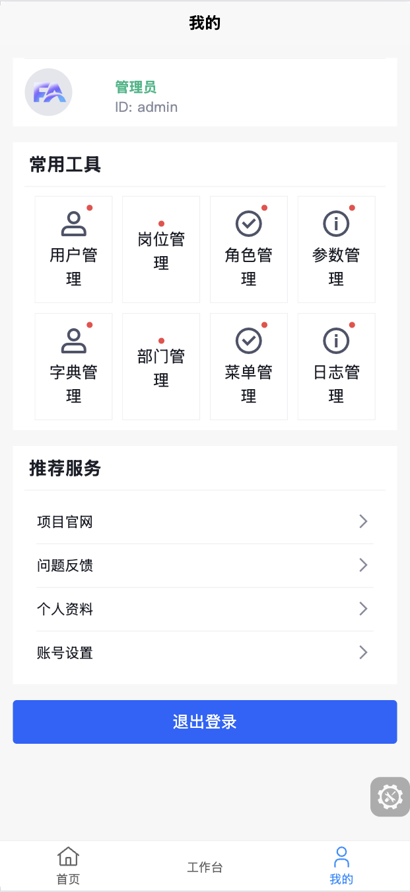
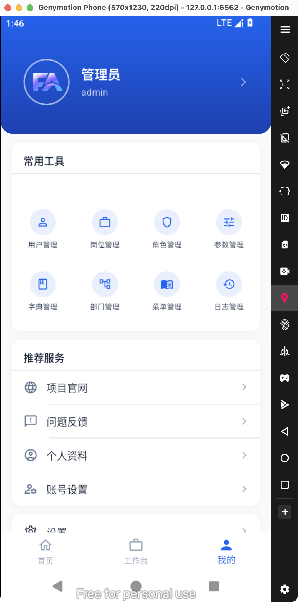
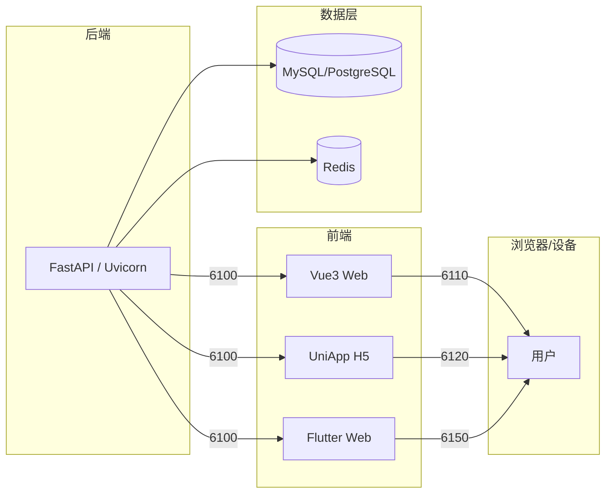

<div align="center">
     <h1>FastApiAdmin <sup style="background-color: #28a745; color: white; padding: 2px 6px; border-radius: 3px; font-size: 0.4em; vertical-align: super; margin-left: 5px;">v3.1.0</sup></h1>
     <h3>现代化全栈快速开发平台模板</h3>
     <p>FastAPI + Vue3 + UniApp + Flutter — 一套框架，三端覆盖</p>
     <p align="center">
          
          
          
          
          
          
          
     </p>
</div>

---

## 📘 项目介绍

**FastApiAdmin v3.0** 是一套**完全开源、高度模块化、三端统一**的现代化全栈开发平台模板。基于 FastAPI 后端 + Vue3 管理后台 + UniApp 小程序 + Flutter 移动端，提供从需求到上线的完整技术栈方案。

> **设计初心**：以模块化、松耦合为核心，追求丰富的功能模块、简洁易用的接口、详尽的开发文档和便捷的维护方式。通过统一框架和组件，降低技术选型成本，遵循开发规范和设计模式，构建强大的代码分层模型。

---

## 📸 界面预览

|                    Web 管理后台                     |                  UniApp 移动端                   |                   Flutter 移动端                   |
| :-------------------------------------------------: | :----------------------------------------------: | :------------------------------------------------: |
|  |  |  |

---

## 🎯 核心优势

| 优势              | 描述                                                    |
| ----------------- | ------------------------------------------------------- |
| 🔥 **三端统一**   | 一套后端，覆盖 Web 管理后台、微信小程序、Flutter 移动端 |
| ⚡ **高性能异步** | FastAPI 异步特性 + Redis 缓存，接口响应速度极快         |
| 🔐 **安全可靠**   | JWT + OAuth2 认证，RBAC 权限控制，数据权限隔离          |
| 🧱 **模块化设计** | 后端按业务竖切分包，前端动态路由注册，高度解耦          |
| 🚀 **快速开发**   | 内置代码生成器，根据数据库表一键生成前后端 CRUD 代码    |
| 🐳 **一键部署**   | Docker Compose 编排，Nginx 反向代理，开箱即用           |
| 🤖 **AI 就绪**    | 内置 Agno 智能体框架，支持 AI 功能扩展                  |

---

## 📦 工程结构

```
fastapiadmin/
├── backend/                 → 后端（FastAPI + SQLAlchemy + MySQL/PostgreSQL/SQLite）
│   ├── app/
│   │   ├── plugin/          → 业务插件（module_*，全部业务模块所在）
│   │   ├── core/            → 核心基础设施（DB/Auth/CRUD/日志/限流/插件框架）
│   │   ├── common/          → 公共组件（响应封装/枚举/常量）
│   │   ├── config/          → 配置（路径/环境变量）
│   │   ├── utils/           → 工具类（加密/Excel/验证/上传）
│   │   ├── scripts/         → 启动脚本与数据初始化
│   │   └── alembic/         → 数据库迁移
│   ├── main.py              → 启动入口（typer CLI）
│   └── pyproject.toml       → 依赖管理（uv）
├── frontend/
│   ├── web/                 → 管理后台（Vue 3 + Element Plus + TypeScript + Vite）
│   │   ├── src/views/       → 页面（系统管理/监控/代码生成等）
│   │   ├── src/router/      → 静态路由 + 动态路由（权限驱动）
│   │   ├── src/store/       → Pinia 状态管理
│   │   └── src/api/         → API 封装
│   ├── uniapp/              → 小程序（UniApp + Wot UI + UnoCSS + Pinia）
│   │   ├── src/pages/       → 页面（首页/登录/个人中心/关于）
│   │   ├── src/http/        → HTTP 请求基础设施
│   │   ├── src/router/      → 路由拦截与权限
│   │   └── src/tabbar/      → 自定义底部导航
│   └── flutter/             → 移动端（Flutter 3.44 + Riverpod + GoRouter + TDesign）
│       ├── lib/common/      → 基础设施（API/Services/Design Tokens）
│       ├── lib/pages/       → 页面（启动/登录/主页）
│       ├── lib/provider/    → Riverpod 状态管理
│       └── lib/router/      → GoRouter 路由配置
└── docker/                  → Docker Compose + Nginx
    ├── docker-compose.yaml  → 服务编排（MySQL + Redis + Backend + Nginx）
    ├── backend/Dockerfile   → 后端容器镜像
    └── nginx/nginx.conf     → 反向代理 + SSL
```

---

## 🛠️ 技术栈

| 层               | 技术                                              | 说明                             |
| ---------------- | ------------------------------------------------- | -------------------------------- |
| **后端框架**     | FastAPI / Uvicorn / Pydantic 2.0 / SQLAlchemy 2.0 | 高性能异步框架，强制类型约束     |
| **数据库迁移**   | Alembic                                           | 自动生成迁移脚本                 |
| **定时任务**     | APScheduler                                       | 任务调度管理                     |
| **认证授权**     | PyJWT + OAuth2 + RBAC                             | JWT 滑动过期，角色/数据双权限    |
| **缓存**         | Redis                                             | 高性能缓存，接口限流             |
| **Web 管理后台** | Vue 3 + Element Plus + TypeScript + Vite + Pinia  | 动态路由，权限驱动菜单           |
| **小程序**       | UniApp (unibest) + Wot UI + UnoCSS + Pinia        | 跨端小程序框架，微信/支付宝/H5   |
| **移动端**       | Flutter 3.44 + Riverpod 3 + GoRouter 17 + TDesign | 跨平台 App，Android/iOS/Web/桌面 |
| **部署**         | Docker Compose + Nginx                            | 容器化一键部署                   |
| **AI 框架**      | Agno                                              | 智能体集成                       |

---

## 📌 内置功能模块

| 模块            | 功能                                           | 描述               |
| --------------- | ---------------------------------------------- | ------------------ |
| 📊 **仪表盘**   | 工作台、分析页                                 | 系统概览和数据分析 |
| ⚙️ **系统管理** | 用户、角色、菜单、部门、岗位、字典、配置、公告 | 核心系统管理功能   |
| 👀 **监控管理** | 在线用户、服务器监控、缓存监控                 | 系统运行状态监控   |
| 📋 **任务管理** | 定时任务                                       | 异步任务调度管理   |
| 📝 **日志管理** | 操作日志                                       | 用户行为审计       |
| 🧰 **开发工具** | 代码生成、表单构建、接口文档                   | 提升开发效率的工具 |
| 📁 **文件管理** | 文件存储                                       | 统一文件管理       |

---

## 🚀 快速开始

### 环境要求

| 类型           | 技术栈                      | 版本                  |
| -------------- | --------------------------- | --------------------- |
| 后端           | Python                      | ≥ 3.14（当前 3.14.7） |
| 后端运行时     | uv / pip                    | 推荐 uv               |
| Web 前端       | Node.js                     | ≥ 20.0                |
| Web 前端包管理 | pnpm                        | ≥ 9                   |
| 移动端 SDK     | Flutter                     | ≥ 3.44                |
| 数据库         | MySQL / PostgreSQL / SQLite | 见 backend/env 配置   |
| 缓存           | Redis                       | ≥ 6.x（建议 7.x）     |

### 1. 后端

```bash
cd backend

# 环境配置
cp env/.env.example env/.env
# 编辑 env/.env 填入数据库和 Redis 配置
# cp env/.env.prod.example env/.env.prod（生产环境）

# 安装依赖（推荐 uv）
uv sync
# 或使用 pip: pip install -r requirements.txt

# 激活当前环境
source .venv/bin/activate

# 确保 MySQL 在运行，然后创建数据库
mysql -u root -p -e "CREATE DATABASE IF NOT EXISTS fastapiadmin DEFAULT CHARACTER SET utf8mb4;"

# 初始化数据库（导入 DDL 初始化文件；PostgreSQL 用 sql/postgres/ 下同名文件）
mysql -u root -p fastapiadmin < sql/mysql/fastapiadmin_ddl.sql

# 启动开发服务（首次启动也会自动建表并写入种子数据）
python main.py run --env=dev
```

API 文档：启动后访问 `http://127.0.0.1:6100/api/v1/docs`（Swagger）

### 2. Web 管理后台

```bash
cd frontend/web

# 安装依赖
pnpm install

# 启动开发服务
pnpm dev
```

访问：`http://127.0.0.1:6110`

### 3. 小程序（UniApp + Wot UI）

```bash
cd frontend/uniapp

# 环境配置
cp env/.env.example env/.env

# 安装依赖
pnpm install

# H5 开发
pnpm dev

# 微信小程序
pnpm dev:mp-weixin
```

### 4. 移动端（Flutter 3.44）

```bash
cd frontend/flutter

# 获取依赖
flutter pub get

# 运行（默认设备）
flutter run

# Web 版本
flutter run -d chrome

# 构建 Android
flutter build apk

# 构建 Web
flutter build web
```

### 5. Docker 部署（两种方式）

**方式 A：全套 Docker**（本机或单机服务器一键起全栈）

```bash
cd docker
cp .env.example .env
cp ../backend/env/.env.prod.example ../backend/env/.env.prod   # 填 SECRET_KEY 等
bash ../deploy.sh
```

**方式 B：只把后端镜像交付到服务器**（服务器已有 MySQL/Redis/Nginx）

```bash
# 开发机：构建并导出镜像
bash deploy.sh image:export 3.1.0

# 服务器：只需编排文件 + 配置 + 镜像包
bash deploy.sh image:load
bash deploy.sh db:migrate
bash deploy.sh start
```

详细说明与服务器 nginx 反代示例见 [`docker/README.md`](./docker/README.md)。

---

## 🏗️ 本地架构与默认端口



| 组件         | 默认地址                            |
| ------------ | ----------------------------------- |
| Web 管理后台 | `http://127.0.0.1:6110`             |
| UniApp H5    | `http://127.0.0.1:6120`             |
| Flutter Web  | `http://127.0.0.1:6150`             |
| 后端 API     | `http://127.0.0.1:6100`             |
| Swagger 文档 | `http://127.0.0.1:6100/api/v1/docs` |
| API 前缀     | `/api/v1`                           |

---

## 🔧 后端二次开发

### 插件化架构

后端已 **全面插件化**：项目采用 **按业务特性分包**（vertical slice）方式组织代码，
**全部业务模块都是插件**，统一放在 `backend/app/plugin/` 下按模块竖切，`app/api/` 已删除。
插件按目录发现，**无集中注册文件**。

```
backend/app/plugin/
├── module_system/          → 系统管理
│   ├── auth/               → 认证/登录
│   ├── user/               → 用户管理
│   ├── role/               → 角色管理
│   └── menu/               → 菜单管理
├── module_common/          → 公共模块（文件/健康检查）
├── module_monitor/         → 系统监控
├── module_application/     → 应用管理
├── module_ai/              → AI 功能
├── module_task/            → 定时任务/工作流
├── module_generator/       → 代码生成器
└── module_example/         → 示例模块
```

每个插件自带三件套：`plugin.toml`（清单）、`plugin.py`（模块级 `PLUGIN = Plugin()` 入口）、
`README.md`（模块定位/入口/依赖/删除影响）。子模块内按逻辑分层：
`controller.py` → `service.py` → `crud.py` → `model.py` / `schema.py`

内核通过 5 个命名 **槽位**（`app/core/plugin/slots.py`）与 **事件总线**
（`app/core/plugin/events.py`）反向获取业务实现，因此 `app/core/` 不依赖任何具体插件。

### 创建新模块

```bash
backend/app/plugin/module_xxx/
├── plugin.toml      # 插件清单（名称/版本/依赖/迁移）
├── plugin.py        # 模块级 PLUGIN = Plugin()
├── README.md        # 模块定位/入口/依赖/删除影响
├── __init__.py
├── controller.py    # API 路由 + 权限
├── model.py         # SQLAlchemy ORM 模型
├── schema.py        # Pydantic 请求/响应模型
├── service.py       # 业务逻辑
└── crud.py          # 数据库操作
```

路由自动挂载，无需手动配置：`controller.py` 顶层的 `APIRouter` 由 `app/core/discover.py`
扫描注册；其余路由、模型映射与种子数据由 `app/core/plugin/runtime.py` 驱动的插件运行时
（`discover → setup → mount → start → stop`）统一处理。

> ⚠️ **四条静默失败红线**（不报错但功能整体失效）详见根目录 [AGENTS.md](./AGENTS.md#后端插件架构重要)
> 与 [`backend/app/core/plugin/README.md`](./backend/app/core/plugin/README.md)。

### 代码生成器

登录管理后台 → 系统工具 → 代码生成，选择数据库表一键生成前后端 CRUD 代码。

---

## 💡 开发规范

### 后端

- Python：`ruff`（行长度 100）+ 4-space 缩进
- 所有公共函数需要类型提示 + Google 风格 docstring
- 新菜单 order 追加末尾，不插入中间

### 前端

- TypeScript/Vue：ESLint 9 + Prettier（2-space 缩进）
- 管理后台：Element Plus 组件库，品牌色 `#FF6B35`
- 小程序：Wot UI 组件库，UnoCSS 原子类，≤3 原子类用内联
- Flutter：Riverpod `Notifier` + `NotifierProvider`，GoRouter 声明式路由，TDesign 组件

---

## 📄 许可证

本项目基于 MIT 许可证开源。

---

<p align="center">如果你喜欢这个项目，给个 ⭐️ 支持一下吧！</p>
